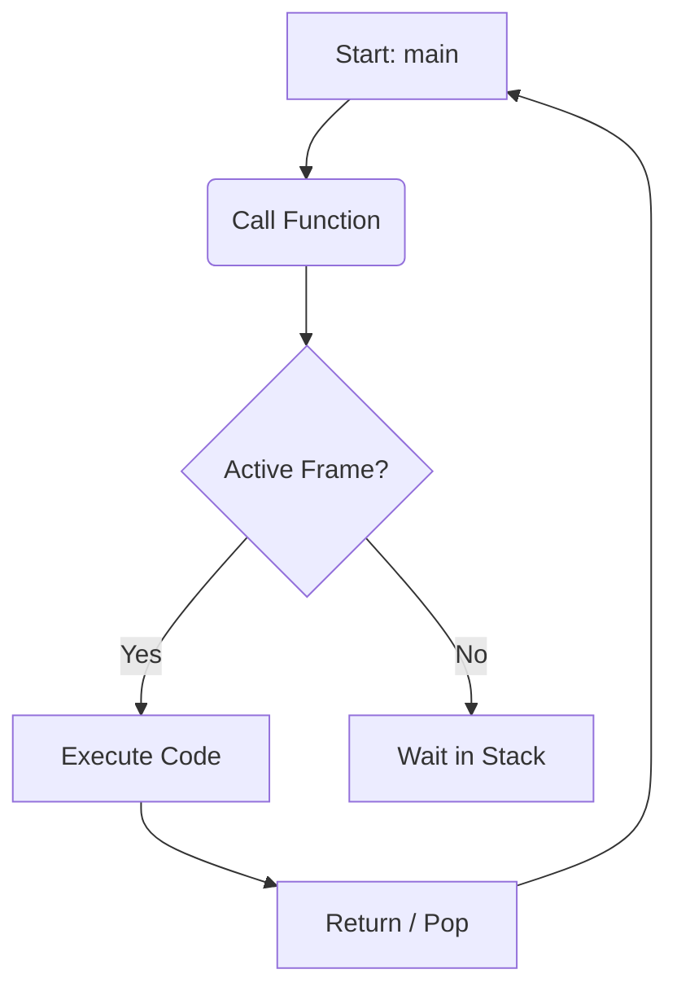

# Markdown Complete Reference Guide

This file contains everything you can do in standard Markdown and GitHub Flavored Markdown (GFM).

---

## 1. Headings (Titoli)
You can create headings from level 1 to 6 by using the `#` symbol.

# Heading 1 (Titolo Principale)
## Heading 2 (Sezione)
### Heading 3 (Sottosezione)
#### Heading 4
##### Heading 5
###### Heading 6

---

## 2. Text Formatting (Formattazione del Testo)

* **Bold text:** Wrap text in `**double asterisks**` or `__double underscores__`.
* *Italic text:* Wrap text in `*single asterisks*` or `_single underscores_`.
* ***Bold and Italic:*** Wrap text in `***triple asterisks***`.
* ~~Strikethrough (Barrato):~~ Wrap text in `~~double tildes~~`.
* Highlight (Evidenziato): Use HTML `<mark>tags</mark>`.
* Superscript: $x^2$ (Using LaTeX syntax `$x^2$`)
* Subscript: $H_2O$ (Using LaTeX syntax `$H_2O$`)

---

## 3. Lists (Elenchi)

### Unordered List (Elenco Puntato)
Use `*`, `-`, or `+`.
* Item 1
* Item 2
  * Sub-item 2.1 (Indent with 2 or 4 spaces)
  * Sub-item 2.2

### Ordered List (Elenco Numerato)
1. First item
2. Second item
   1. Sub-item 2.1
   2. Sub-item 2.2

### Task List (Lista di Controllo)
* [x] Completed task
* [ ] Incomplete task
* [ ] Another task

---

## 4. Links and Images (Collegamenti e Immagini)

### Links
* **Standard Link:** [Click here to visit GitHub](https://github.com)
* **Link with Tooltip:** [Hover over me](https://google.com "This is a tooltip")
* **Raw URL:** https://github.com

### Images
Syntax: ``


---

## 5. Blockquotes (Citazioni)

Use the `>` symbol before the text.

> This is a standard blockquote.
> It can span multiple lines if you keep adding the symbol.
>
>> You can also nest blockquotes by using `>>`.

---

## 6. Code Blocks and Syntax Highlighting

### Inline Code
Use single backticks to highlight a variable or command like `sudo apt-get` or `int main()`.

### Fenced Code Blocks
Use triple backticks (\`\`\`) and specify the language name for syntax highlighting.

```python
def hello_world():
    print("Hello, World!")
    return True
```

## 7. Callouts (Admonitions)
Extended syntax supported by Obsidian, GitHub, and Notion-like editors to create visual alert boxes.

> [!NOTE]
> This is a standard note callout. Useful for general tips or thoughts.

> [!WARNING]
> This is a warning callout. Use it to highlight critical details or common mistakes.

## 8. Advanced Elements

### LaTeX (Mathematical Notation)
Obsidian and advanced Markdown editors support LaTeX for rendering mathematical expressions.
* **Inline Math:** Wrap the expression in single dollar signs `$`. 
  Example: The Pythagorean theorem is $a^2 + b^2 = c^2$.
* **Display Math (Block):** Wrap the expression in double dollar signs `$$` on separate lines to center it.
  Example:
  $$E = mc^2$$

### Mermaid (Diagrams and Flowcharts)
You can create diagrams, flowcharts, and sequence charts using text syntax inside a fenced code block labeled `mermaid`.


