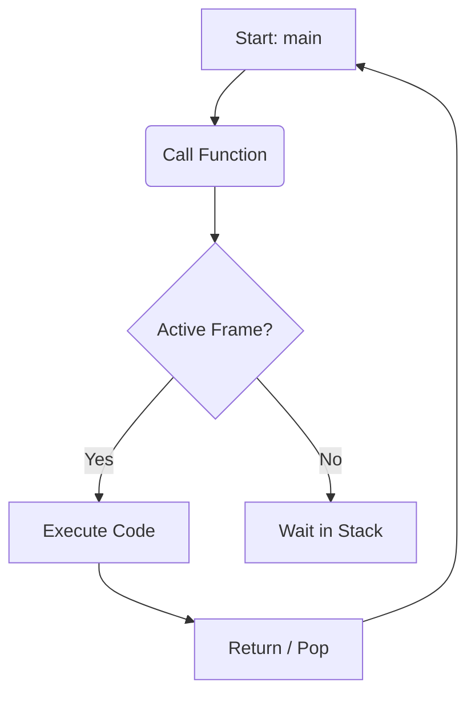

# Markdown Complete Reference Guide

This file contains everything you can do in standard Markdown and GitHub Flavored Markdown (GFM).

---

## 1. Headings (Titoli)
You can create headings from level 1 to 6 by using the `#` symbol.

# Heading 1 (Titolo Principale)
## Heading 2 (Sezione)
### Heading 3 (Sottosezione)
#### Heading 4
##### Heading 5
###### Heading 6

---

## 2. Text Formatting

* **Bold text:** Wrap text in `**double asterisks**` or `__double underscores__`.
* *Italic text:* Wrap text in `*single asterisks*` or `_single underscores_`.
* ***Bold and Italic:*** Wrap text in `***triple asterisks***`.
* ~~Strikethrough (Barrato):~~ Wrap text in `~~double tildes~~`.
* Highlight (Evidenziato): Use HTML `<mark>tags</mark>`.
* Superscript: $x^2$ (Using LaTeX syntax `$x^2$`)
* Subscript: $H_2O$ (Using LaTeX syntax `$H_2O$`)

---

## 3. Lists

### Unordered List
Use `*`, `-`, or `+`.
* Item 1
* Item 2
  * Sub-item 2.1 (Indent with 2 or 4 spaces)
  * Sub-item 2.2

### Ordered List
1. First item
2. Second item
   1. Sub-item 2.1
   2. Sub-item 2.2

### Task List
* [x] Completed task
* [ ] Incomplete task
* [ ] Another task

---

## 4. Links and Images

### Links
* **Standard Link:** [Click here to visit GitHub](https://github.com)
* **Link with Tooltip:** [Hover over me](https://google.com "This is a tooltip")
* **Raw URL:** https://github.com

### Images
Syntax: ``


---

## 5. Blockquotes

Use the `>` symbol before the text.

> This is a standard blockquote.
> It can span multiple lines if you keep adding the symbol.
>
>> You can also nest blockquotes by using `>>`.

---

## 6. Code Blocks and Syntax Highlighting

### Inline Code
Use single backticks to highlight a variable or command like `sudo apt-get` or `int main()`.

### Fenced Code Blocks
Use triple backticks (\`\`\`) and specify the language name for syntax highlighting.

```python
def hello_world():
    print("Hello, World!")
    return True
```

## 7. Callouts (Admonitions)
Extended syntax supported by Obsidian, GitHub, and Notion-like editors to create visual alert boxes.

### General Information & Notes

> [!NOTE]
> Blue box for general information, notes, and deep dives.

> [!INFO]
> Identical to NOTE, also blue, used for informational details.

> [!TODO]
> Light blue box with a checkbox, perfect for tracking tasks or pending actions.
### Tips & Successes

> [!TIP]
> Teal/green-blue box, ideal for practical advice, tricks, or shortcuts.

> [!HINT]
> Identical to TIP, teal, used for hints or study clues.

> [!SUCCESS]
> Bright green box with a checkmark. Perfect for goals achieved, correct solutions, or passed tests.

### Warnings & Attention

> [!WARNING]
> Orange box with a warning triangle. Used to highlight common mistakes or behaviors to watch out for.

> [!CAUTION]
> Dark orange/red box for critical warnings that require strong attention.

> [!ATTENTION]
> Identical to CAUTION, orange/red, to draw attention to critical concepts.

### Danger & Errors

> [!FAILURE]
> Red box with a cross. Useful for documenting crashes, compilation errors, or failed attempts.

> [!DANGER]
> Deep red box to signal severe critical errors or things to absolutely avoid in your code.

### Quotes, Ideas & Other Types

> [!QUOTE]
> Light gray box with quotation marks for inserting text quotes, definitions, or famous sayings.

> [!ABSTRACT]
> Purple/indigo box, excellent for summaries, chapter abstracts, or high-level overviews.

> [!EXAMPLE]
> Light purple box, perfect for inserting code snippets or case studies.

> [!QUESTION]
> Yellow/amber box with a question mark. Ideal for personal doubts, open questions, or exercises to solve.
### 💡 Two Useful Syntax Tricks for Obsidian:

1. **Custom Title:** You can change the default header text by writing right after the closing bracket.

> [!TIP] My Custom Title
> Box content goes here...

2. **Collapsible Box:** If you want the box to be toggleable so it doesn't clutter your note, add a `-` (collapsed by default) or a `+` (expanded by default) right after the bracket.

> [!NOTE]- Click to expand this note
> This text will remain hidden until you click on the header.

## 8. Advanced Elements

### Mermaid (Diagrams and Flowcharts)
You can create diagrams, flowcharts, and sequence charts using text syntax inside a fenced code block labeled `mermaid`.



# LaTeX (Mathematical Expressions)

 In Markdown (and Obsidian), the dollar sign `$` is used to render clean, professional math symbols and equations.
 
 * **Inline Math (`$...$`):** Keeps variables or formulas inside the text line.
	*Example:* `$n$` becomes $n$.
* **Display Math (`$$...$$`):** Centers the formula and makes it larger on its own line.
	 *Example:* `$$\frac{n(n-1)}{2}$$` creates a formatted fraction.
 $$\frac{n(n-1)}{2}$$
# LaTeX for Algorithm Analysis

In LaTeX, curly braces `{}` act as **grouping tokens**. Instead of being printed as text, they define the **scope** of a command, telling LaTeX exactly which part of the expression the operator applies to.

---
### 1. The Role of Curly Braces `{}`

If a command needs to apply to more than a single character, you must enclose the target block within braces.

* **Exponents (`^`)**: Typing `$x^10$` renders as $x^10$ (only the first digit is elevated). To elevate the whole number, group it: `$x^{10}$` $\rightarrow$ $x^{10}$.
* **Fractions (`\frac`)**: They require two sequential groups of braces: `\frac{numerator}{denominator}`. For example: `$\frac{a+b}{c}$` $\rightarrow$ $\frac{a+b}{c}$.

> [!NOTE]
> To display literal curly braces in your text without triggering a command, escape them with a backslash: `$\{ x \}$` $\rightarrow$ $\{ x \}$.

---

### 2. Common Operators for Big O Notation

| Operation / Symbol | LaTeX Code | Rendered Output |
| :--- | :--- | :--- |
| **Logarithm** | `$\log n$` | $\log n$ |
| **Greater than or equal to** | `$n \ge 1$` | $n \ge 1$ |
| **Less than or equal to** | `$n \le 1$` | $n \le 1$ |
| **Multiplication (dot)** | `$n \cdot \log n$` | $n \cdot \log n$ |
| **Multiplication (cross)** | `$2 \times 2$` | $2 \times 2$ |
| **Omega Notation** | `$\Omega(n)$` | $\Omega(n)$ |
| **Theta Notation** | `$\Theta(n)$` | $\Theta(n)$ |

---

### 3. Auto-Scaling Parentheses

Standard parentheses `( )` do not scale automatically and will look too small when enclosing tall elements like fractions. 

To dynamically adjust their height to match the expression inside, prepend the modifiers `\left` and `\right` before the brackets:

* **Unscaled:** `$(\frac{n}{2})$` $\rightarrow$ $(\frac{n}{2})$
* **Auto-scaled:** `$\left(\frac{n}{2}\right)$` $\rightarrow$ $\left(\frac{n}{2}\right)$

> [!TIP]
> This dynamic scaling works seamlessly with any delimiter type, including square brackets `\left[` / `\right]` and escaped curly braces `\left\{` / `\right\}`.
 