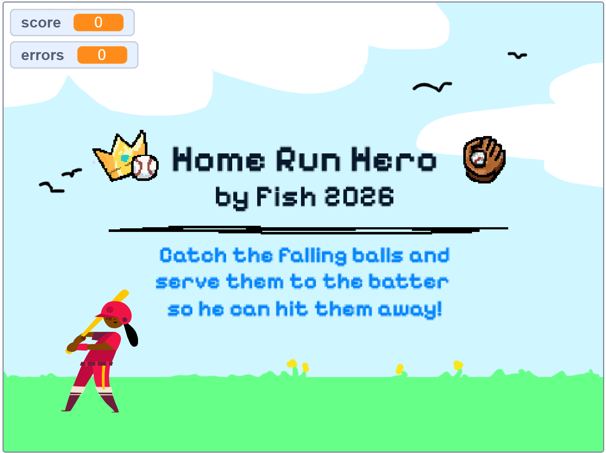

# Home Run Hero

A retro arcade-style baseball game developed as my Project 0 for Harvard's CS50x 2026.

## Project Description
Home Run Hero is a fast-paced skill game where the player must catch falling baseballs and serve them to the batter. The game focuses on precision and timing, featuring a progressive difficulty system where the speed of the falling balls increases as the player scores points.

## Key Features:
* **Custom Graphics:** All UI elements, titles, and icons were custom-designed using Pixelify Sans to achieve a consistent pixel-art aesthetic.
* **Dynamic Soundscape:** Features custom sound effects for scoring and Game Over events.
* **Progressive Difficulty:** The game logic scales with your score, making it harder to catch balls as you progress.
* **Win/Loss Logic:** Reach 50 points to win, but be careful—3 errors and you're out!

## Technical Details
* **Platform:** Developed in Scratch 3.0.
* **Logic:** Implemented using broadcast messages, variables for score tracking, and collision detection between sprites.
* **Credits:** Core concept inspired by "Oscartime". Standard sprites (like the Batter) and ambient sounds are from the official Scratch Library. All other assets are original.

## How to Play
1. **Catch:** Drag the falling baseballs with your mouse.
2. **Serve:** Release the ball over the Batter sprite to score a point.
3. **Avoid:** Don't let the balls touch the black line on the ground (errors).
