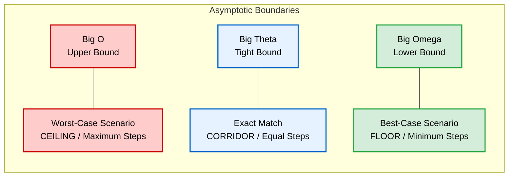

# Week 3: Algorithms

## Index

* [Counting Methods & Visualizing Algorithms](#counting-methods--visualizing-algorithms)
* [Understanding Big O Notation](#understanding-big-o-notation)
* [Running Time and Time Complexity](#running-time-and-time-complexity)
* [Asymptotic Notation (Notazione Asintotica)](#asymptotic-notation-notazione-asintotica)
* [The Three Types of Asymptotic Boundaries](#the-three-types-of-asymptotic-boundaries)
* [Quadratic vs. Exponential Growth](#quadratic-vs-exponential-growth)
* [The Two Sorting Algorithms](#the-two-sorting-algorithms)
* [Understanding Recursion: Notes & Analogies](#understanding-recursion-notes--analogies)
* [Merge Sort & Big O Complexity](#merge-sort--big-o-complexity)
* [The Call Stack](#the-call-stack)
* [Recursion in Action: Factorial and Fibonacci](#recursion-in-action-factorial-and-fibonacci)
* [Defining Custom Data Structures in C](#defining-custom-data-structures-in-c)

## Counting Methods & Visualizing Algorithms

When we need to solve a problem, like counting the total number of people in a room, the efficiency of our program depends entirely on the algorithm we choose.

### 1. Linear Counting (The Naive Approach)
This is the most basic method, equivalent to the "verbalized algorithm" used in Week 0 to count pages one by one.
* **How it works:** One counter walks through the room, pointing at each person and incrementing the total by 1 ($1, 2, 3, 4...$).
* **Characteristics:** It is slow but simple. If there are $n$ people, it takes exactly $n$ steps.

### 2. Recursive Counting (The CS50 Audience Experiment)
Instead of using a single counter, this approach divides the problem into identical sub-problems.
* **How it works:** 
  1. Every person stands up and holds the value `1`.
  2. People pair up. One person adds both values together, while the partner sits down.
  3. The remaining people repeat the process with their new, larger values.
* **Characteristics:** The problem size splits in half during each cycle. Eventually, only one person remains standing, holding the total sum.

### 3. Key Distinction: Iteration vs. Recursion
* **Iteration:** Solving a problem by repeating a process using loops (like `for` or `while` statements) over a dataset.
* **Recursion:** A technical concept where a function solves a problem by calling a smaller version of itself.
---

## Understanding Big O Notation

In computer science, we don't measure the speed of an algorithm in seconds, because a faster computer will always execute code quicker than an older one. Instead, we measure **Time Complexity**: *how the number of steps increases as the size of the input grows.*

**Big O notation** is the mathematical language we use to describe the **worst-case scenario** of an algorithm (the absolute maximum number of steps required to finish the job).

Think of the capital **O** as standing for *"On the order of"*.

### Common Big O Running Times (From Slowest to Fastest Growth)

#### 1. $O(n)$ Linear Time
* **Meaning:** The number of steps grows proportionally to the size of the input ($n$).
* **Example:** The basic, page-by-page or person-by-person counting method. If you have 100 people, it takes 100 steps. If you have 1,000 people, it takes 1,000 steps.

#### 2. $O(\log n)$ Logarithmic Time
* **Meaning:** The problem space is divided in half at every single step. As the input grows huge, the number of steps increases very slowly.
* **Example:** **Binary Search** (the phone book experiment where you flip to the middle and tear pages in half) or the **Recursive Counting** experiment with the audience. Even if you double the number of people in the theater, it only adds *one extra step* to the whole process.

#### 3. $O(1)$ Constant Time
* **Meaning:** The algorithm always takes the exact same number of steps, regardless of how big the input is.
* **Example:** Checking if a single number is even or odd, or looking at the value held by the very last person standing in the theater. It takes 1 step whether there are 10 people or 10,000.

## Running Time and Time Complexity

**Running Time** (or **Time Complexity**) refers to the efficiency of an algorithm. It does not measure time in seconds, but rather the number of mathematical or computational steps required to solve a problem as the size of the input ($n$) grows.

In computer science, we use **Big O Notation** to categorize an algorithm's running time based on its **worst-case scenario** (the absolute maximum number of steps it could take).

### Terminology & Descriptions

When describing how fast or efficient an algorithm is, we can say:
* *"This algorithm has a **linear running time**."* or *"This algorithm is **linear**."*
* In Italian, we refer to this concept as **Complessità Temporale** (e.g., *"Questo algoritmo ha una complessità logaritmica"*).

### Summary of Running Times (From Worst to Best)

| Big O Notation | Pronunciation (EN / IT) | Technical Name | Algorithm Example |
| :--- | :--- | :--- | :--- |
| **$O(n)$** | *"Big O of n"*<br>• *"O di enne"* | **Linear Time**<br>• *Tempo Lineare* | **Linear Search** (checking every element one by one) |
| **$O(\log n)$** | *"Big O of log n"*<br>• *"O di log enne"* | **Logarithmic Time**<br>• *Tempo Logaritmico* | **Binary Search** (dividing the dataset in half each step) |
| **$O(1)$** | *"Big O of 1"*<br>• *"O di uno"* | **Constant Time**<br>• *Tempo Costante* | **Direct Lookup** (instantly checking a single known index) |

### Advanced Big O Running Times (From Fastest to Slowest Growth)

#### 4. $O(n \log n)$ Linearithmic Time (Tempo Linearitmico)
* **Meaning:** This is a combination of linear time ($n$) and logarithmic time ($\log n$). It represents algorithms that divide a problem in half (logarithmic) but must repeat that division process for every single element in the dataset (linear).
* **Example:** Efficient sorting algorithms, like **Merge Sort**. It is the standard benchmark for sorting large datasets efficiently.

#### 5. $O(n^2)$ Quadratic Time (Tempo Quadratico)
* **Meaning:** The number of steps grows exponentially relative to the square of the input size. If you double the dataset size ($2n$), the execution steps quadruple ($4n^2$). This happens when an algorithm uses nested loops (a loop inside another loop) to compare every element with every other element.
* **Example:** Slow, brute-force sorting algorithms like **Bubble Sort** or **Selection Sort**. If you have 1,000 players to sort by score using Bubble Sort, it could take up to 1,000,000 steps.

#### 6. $O(2^n)$ Exponential Time (Tempo Esponenziale)
* **Meaning:** The number of steps doubles with every single additional element added to the dataset. This is extremely inefficient and represents algorithms that try every possible combination or solution to a problem.
* **Example:** Solving complex puzzles like the Traveling Salesperson Problem by brute force, or calculating Fibonacci numbers using a naive recursive approach. Even with a small input (like $n = 50$), an $O(2^n)$ algorithm can take years to finish executing on a supercomputer.

## Asymptotic Notation (Notazione Asintotica)

### What does "Asymptotic" mean?
The word **Asymptotic** (from the mathematical term *asymptote*) refers to looking at the behavior of a function as it approaches infinity. 

In computer science, **Asymptotic Notation** means evaluating how an algorithm performs as the input size ($n$) becomes **extremely large (approaching infinity)**. 
* It ignores hardware speed, system background tasks, and minor constants (like whether a loop takes $n+2$ or $n+5$ steps).
* It focuses strictly on the "shape" of the growth curve of the algorithm's running time.
  
## In short

Asymptotic notation describes how the workload grows for the **CPU**, indicating the algorithm's complexity. Mathematical expressions are used instead of **execution time** because the complexity of an algorithm does not depend on the hardware. This is  called **asymptotic running time**.

---

## The Three Types of Asymptotic Boundaries

To fully describe an algorithm's efficiency, we use three different mathematical symbols, each representing a different scenario: **Worst-Case**, **Best-Case**, and **Tight-Bound**.



---

 **Mermaid Quick Reference (Extra)**

> **What is Mermaid?** A JavaScript-based tool that renders text syntax into visual diagrams directly within Markdown. It uses a logic similar to programming languages combined with CSS-like styling properties.

#### 1. Graph Direction
* `graph TD`: Top-Down (Dall'alto verso il basso)
* `graph LR`: Left-to-Right (Da sinistra a destra)

#### 2. Node Shapes (Forme dei blocchi)
* `ID[Text]`: Rectangle (Rettangolo classico)
* `ID(Text)`: Rounded Rectangle (Rettangolo smussato)
* `ID{Text}`: Diamond (Rombo per condizioni/decisioni `if`)

#### 3. Connections (Collegamenti)
* `A --> B`: Arrow connection (Linea con freccia)
* `A --- B`: Simple line connection (Linea semplice senza freccia)
* `A -->|Label| B`: Arrow with text (Freccia con testo descrittivo)

#### 4. Comments & Styling
* `%%`: Used to write comments within the Mermaid block (Ignored by the compiler).
* `classDef`: Defines custom CSS styles (e.g., `fill` for background, `stroke` for borders, `color` for text).
* `class`: Applies a defined style to specific nodes.

*Test and build diagrams in real-time using the official [Mermaid Live Editor](https://mermaid.live/).*

---

### 1. Big O ($O$) — The Upper Bound (Worst-Case)
* **Definition:** The mathematical representation of the **maximum** number of steps an algorithm will ever take. It guarantees that the algorithm will never perform worse than this curve.
* **Analogy:** A ceiling. The running time cannot go above it.
* **Example:** For **Linear Search**, the worst-case is that the item is at the very end of the list or not there at all: **$O(n)$**.

### 2. Big Omega ($\Omega$) — The Lower Bound (Best-Case)
* **Definition:** The mathematical representation of the **minimum** number of steps an algorithm can take. It describes the absolute best-case scenario.
* **Pronunciation:** *"Big Omega"* / *"Omega"*
* **Analogy:** A floor. The running time cannot drop below it because the computer must perform at least this many steps.
* **Example:** For **Linear Search**, the best-case is finding the item on the very first try: **$\Omega(1)$**.

### 3. Big Theta ($\Theta$) — The Tight Bound (The Exact Match)
* **Definition:** This symbol is used **only** when the worst-case scenario ($O$) and the best-case scenario ($\Omega$) are exactly identical. It represents a tight bound, meaning the algorithm always behaves exactly the same way regardless of the data structure.
* **Pronunciation:** *"Big Theta"* / *"Theta"* (In Italian: *"Capital Theta"*)
* **Analogy:** A narrow corridor where the ceiling and floor meet.
* **Example:** An algorithm that counts elements by walking through a room one by one. Even if the room is full of your friends or total strangers, the algorithm *must* check every single person. Its best-case is $n$ steps ($\Omega(n)$) and its worst-case is $n$ steps ($O(n)$). Therefore, its tight bound is **$\Theta(n)$**.

---

### Quick Comparison Table for Reference

| Notation      |  Symbol  | Scenario        | What it represents          | Example (Linear Search)           |
| :------------ | :------: | :-------------- | :-------------------------- | :-------------------------------- |
| **Big O**     |   $O$    | **Worst-Case**  | Maximum ceiling             | $O(n)$ — Item is last             |
| **Big Omega** | $\Omega$ | **Best-Case**   | Minimum floor               | $\Omega(1)$ — Item is first       |
| **Big Theta** | $\Theta$ | **Tight Bound** | Floor and Ceiling are equal | *Not applicable to Linear Search* |

---
# Quadratic vs. Exponential Growth

Both terms describe how a program slows down as data ($n$) increases, but they grow at vastly different speeds.

### 1. Quadratic Growth: $O(n^2)$
- **How it works:** The data size ($n$) is the *base*, raised to a constant power (2).
- **Formula pattern:** $n \times n$
- **Example:** If $n = 10$, operations = $10^2 = 100$. If $n$ doubles to $20$, operations = $20^2 = 400$ (4 times more).
- **Context:** Slow for huge datasets, but very common in basic sorting algorithms.

### 2. Exponential Growth: $O(2^n)$
- **How it works:** The data size ($n$) is the *exponent*. Every time you add just **one** single item to your data, the total work **doubles**.
- **Formula pattern:** $2 \times 2 \times 2...$ ($n$ times)
- **Example:** If $n = 10$, operations = $2^{10} = 1,024$. If $n$ doubles to $20$, operations = $2^{20} = 1,048,576$.
- **Context:** Extremely dangerous. Programs with exponential growth quickly become impossible to run, even for supercomputers.

---

# The Two Sorting Algorithms

Malan uses these two classic algorithms to show **Quadratic $O(n^2)$** efficiency in action:
### 1. Selection Sort
- **How it works:** It scans the entire array to find the smallest element, swaps it into the first position, then moves to the next position and repeats.
- **Analogy:** Looking through a messy pile of cards from left to right, finding the lowest card, putting it at the start, and repeating.
- 
> [!NOTE]
> **In-Place Algorithms**
> An algorithm is considered **in-place** when it mutates the input data directly within the original data structure, without requiring extra auxiliary memory.
> 
> * **Memory Efficiency**: It operates with a space complexity of $O(1)$ because it only uses a tiny, constant amount of RAM for temporary variables during swaps.
> * **Selection & Bubble Sort**: Both are in-place algorithms; they sort the array directly on the spot.
> * **Merge Sort**: It is **not** an in-place algorithm because it must allocate temporary arrays in RAM to merge the sorted halves, resulting in a space complexity of $O(n)$.
### 2. Bubble Sort
- **How it works:** It compares adjacent pairs of numbers next to each other and swaps them if they are in the wrong order. It loops through the array repeatedly until the highest numbers "bubble up" to the end.
- **Analogy:** Comparing card 1 and card 2, swapping them if needed, then comparing card 2 and card 3, moving down the line until the deck is sorted.

---
*appunto sul lessico: from the get-go = dall'inizio*

# Understanding Recursion
## 1. The Core Concept
Recursion occurs when a function calls itself to solve a smaller instance of the same problem. Instead of using iterative loops (`for` or `while`) to compute everything upfront (in anticipo), a recursive function delegates smaller chunks of work to subsequent versions of itself.

## 2. Iterative vs. Recursive Mindset
* **Iterative Approach (Bottom-Up / Counting):** Computes the output step-by-step using a loop. It relies on a state counter that advances until a condition is met.
* **Recursive Approach (Top-Down / Deferred):** Breaks the problem down into a **Base Case** and a **Recursive Case**. It accumulates operations in memory and executes them in reverse order once the bottom is reached.

---

## 3. The Minecraft Pyramid Analogy
<small><i>To my old friend T: I was crushing it, not K. Memory doesn't scale, logic does.</i></small>

When building a maximum-buff beacon pyramid in Minecraft, a purely mnemonic approach relies on remembering static data (e.g., *"the base is 9x9"*). A computational/recursive approach relies on system rules:
1.  **Base Case (The minimum functional unit):** A $3 \times 3$ layer.
2.  **Height Variable ($n$):** The total number of layers.

To build a pyramid of height $n$, you don't need to pre-calculate the base. The system evaluates the layers backward until it hits the minimum $3 \times 3$ unit, and then builds the rest mechanically by expanding outward layer by layer.

<small><i>This wasn't a matter of personal taste or subjective opinions. Objectively, teaching the logical rule was the superior choice. Video games are not just games; they are powerful educational tools. Relying purely on memory forces a kid's brain into a rigid system that cannot scale. If they only memorize that a maximum base is 9x9, they get completely stuck when trying to build a custom 20-layer pyramid. By teaching the systematic rule of expanding outward layer by layer, you aren't just teaching a building trick: you are actively developing an algorithmic mindset and genuine problem-solving skills.</i></small>

---

## 4. Code Breakdown (CS50 `draw` Example)
In David J. Malan's CS50 lecture, the recursive function to draw a half-pyramid looks like this:

```c
void draw(int n)
{
    // 1. Base Case
    if (n <= 0)
    {
        return;
    }

    // 2. Recursive Case (The Pause)
    draw(n - 1);

    // 3. Action (The Print)
    for (int i = 0; i < n; i++)
    {
        printf("#");
    }
    printf("\n");
} 
```

## 6. Understanding Segmentation Fault & Core Dump (extra)

### Segmentation Fault (SegFault)
A **Segmentation Fault** is a generic error triggered by the operating system when a program attempts to access a restricted memory zone that does not belong to it. 
* In the context of recursion, it is usually the direct consequence of a **Stack Overflow**. When the memory stack runs out of space due to infinite recursive calls, the program spills over into forbidden memory territory, and the OS terminates it immediately.

### Core Dump
Historically, computer RAM was made of magnetic-core memory, which is why Unix/Linux systems still refer to the active RAM as the **"Core"**.
* **"Dumped"** means to empty or unload.
* When a program crashes due to a critical error like a SegFault, the operating system takes a "snapshot" of the exact state of the RAM at that millisecond and dumps it into a file (usually named `core`).
* A Core Dump does not clear or fix the memory; it acts as a flight data recorder (black box) for post-mortem debugging, allowing programmers to inspect variables and the stack state at the moment of the crash.

# Merge Sort & Big O Complexity

## 1. The Core Concept (Divide and Conquer)
Merge Sort is a highly efficient, recursive sorting algorithm that uses the **Divide and Conquer** strategy. Instead of sorting the entire list at once, it breaks the problem down into smaller, easily manageable sub-problems:
1.  **Divide:** Split the unsorted list in half until you have sub-lists that contain only 1 element each.
2.  **Conquer:** A list with a single element is inherently sorted (this is the **Base Case**).
3.  **Combine (Merge):** Recursively merge the sub-lists back together in the correct sorted order until you get the final sorted list.

## 2. Why is Merge Sort $O(n \log n)$?
The time complexity of Merge Sort is always $O(n \log n)$, regardless of whether the array is already sorted or completely reversed. This formula comes from multiplying two distinct operations that happen simultaneously:

### Part 1: The $\log n$ (The "Divide" Phase)
Every time you split the array in half, you are performing a logarithmic operation. 
* If you have $8$ elements, you split them into $4$, then $2$, then $1$. That takes **3 steps**.
* Mathematically, $\log_2(8) = 3$. 
The logarithm ($\log n$) represents the number of times you can divide an array of size $n$ in half before reaching individual elements. This determines the **height of the recursion tree**.

### Part 2: The $n$ (The "Merge" Phase)
Once the array is split into single elements, you must merge them back together. 
* To merge two sorted halves, the computer has to look at every single element to decide which one is smaller and copy it into the new array.
* If the total number of elements is $n$, each level of the recursion tree requires exactly $n$ operations to merge the pieces back.

### The Combination: $n \times \log n$
Since you have to perform $n$ merge operations at each of the $\log n$ levels of division, you multiply them together:
$$\text{Total Time} = (\text{Number of levels}) \times (\text{Work per level}) = \log n \times n = n \log n$$

---

## 3. Comparison with Bubble Sort

* **Bubble Sort ($O(n^2)$):** As $n$ grows, the execution time grows quadratically. If $n = 10,000$, Bubble Sort takes roughly $100,000,000$ operations.
* **Merge Sort ($O(n \log n)$):** If $n = 10,000$, $\log_2(10,000) \approx 14$. Therefore, Merge Sort takes roughly $10,000 \times 14 = 140,000$ operations. It is exponentially faster for large datasets.

> [!NOTE]
> **The Origin and Definition of the Word "Algorithm"**
> 
> The word **algorithm** is a medieval Latin corruption of a proper name. It originates from the 9th-century Persian mathematician, astronomer, and geographer **Muḥammad ibn Mūsā al-Khwārizmī**. When his groundbreaking mathematical treatises on Hindu-Arabic numerals and algebra were translated into Latin during the Middle Ages, his epithet *al-Khwārizmī* (meaning "the native of Khwarazm") was phonetically adapted into **"Algoritmi"**. 
> 
> Over time, the phrase *"dixit Algoritmi"* ("thus said Algoritmi") became synonymous with the step-by-step procedures for calculation he developed, eventually evolving into the modern term we use today to describe a finite sequence of well-defined, unambiguous instructions to solve a problem.
>
> ---
> **Sources & Authoritative References (Treccani):**
> - [Vocabolario Treccani — Algoritmo](https://www.treccani.it/vocabolario/algoritmo/) (Etymology and linguistic definition)
> - [Enciclopedia della Matematica Treccani — Algoritmo](https://www.treccani.it/enciclopedia/algoritmo_(Enciclopedia-della-Matematica)/) (Technical analysis of mathematical and computational requirements)

## The Call Stack

When a program runs, the CPU needs a way to keep track of which function is currently executing, where it was called from, and what local variables belong to it. This tracking happens in a specific region of the RAM called the **Stack**.

The **Call Stack** is a data structure that operates on a **LIFO** (Last In, First Out) basis. You can think of it like a stack of t-shirts in a drawer: you can only add or remove a shirt from the very top.

### Key Concepts

*   **Stack Frame (or Function Frame):** A designated chunk of memory allocated for a single function when it is called. It contains the function's local variables, arguments, and the return address (where to go back in the code when the function finishes).
*   **Active Frame:** Although multiple stack frames can exist in memory simultaneously (e.g., when one function calls another), only the frame at the very top of the stack is active and accessible at any given time.
*   **Push:** The act of adding a new stack frame to the top of the stack when a function is called.
*   **Pop:** The act of removing a stack frame from the top of the stack when a function finishes executing (`return`).

> [!NOTE]
**Memory Doesn't Physically Move**
When a frame is "popped" and "goes away," the physical memory cells do not move, nor are they instantly wiped clean. Instead, a CPU register called the **Stack Pointer** simply moves back to the previous frame. The memory used by the completed function is marked as available, and its old data will remain there until it gets overwritten by the next function call.

### Memory Layout: Stack vs. Heap (extra)

The RAM allocated for a running program is divided into distinct sections:

*   **The Stack:** A highly organized, fast, and automatically managed memory area used for local variables and function calls (via stack frames).
*   **The Heap:** A large, unorganized pool of memory used for dynamic memory allocation. Unlike the stack, data in the heap does not follow a strict LIFO order and must be managed manually by the programmer.
---
# Recursion in Action: Factorial and Fibonacci

In computer science, recursion is an algorithmic pattern where a function calls itself to solve smaller instances of the same problem. To avoid infinite loops and a subsequent **Stack Overflow**, every recursive function must possess a **Base Case** (the stopping condition) and a **Recursive Case** (the step that reduces the problem).

## 1. The Factorial Function ($n!$)

The factorial of a positive integer $n$ (written as $n!$) is the product of all positive integers less than or equal to $n$.

### Mathematical Concept

$$n! = n \times (n - 1) \times (n - 2) \times \dots \times 1$$

- _Example ($4!$):_ $4! = 4 \times 3 \times 2 \times 1 = 24$
    

### The Recursive Core

Factorial is naturally recursive because $4!$ can be rewritten as $4 \times 3!$. Therefore, the general rule to find the factorial of $n$ is to multiply $n$ by the factorial of $n - 1$.

- **Base Case:** If $n = 0$ or $n = 1$, return `1`. _(Note: $0! = 1$ because there is exactly 1 unique way to arrange 0 items—by leaving the space empty)._
    
- **Recursive Case:** For any $n > 1$, return $n \times \text{factorial}(n - 1)$.
    

### C Code Implementation

C

``` c
int factorial(int n)
{
    // Base Case
    if (n == 0 || n == 1)
    {
        return 1;
    }
    // Recursive Case
    return n * factorial(n - 1);
}
```

## 2. The Fibonacci Sequence

The Fibonacci sequence is a famous mathematical series where each number is the sum of the two preceding ones, usually starting from 0 and 1.

$$\text{Sequence: } 0, 1, 1, 2, 3, 5, 8, 13, 21, 34 \dots$$

### The Recursive Core

To find the Fibonacci number at position $n$, the system must split into **two recursive calls** simultaneously. It calculates the value of the two previous positions ($n-1$ and $n-2$) and adds them together.

- **Base Cases:**
    
    - If $n = 0$, return `0`.
        
    - If $n = 1$, return `1`.
        
- **Recursive Case:** For any $n > 1$, return $\text{fibonacci}(n - 1) + \text{fibonacci}(n - 2)$.
    

### C Code Implementation

``` c
int fibonacci(int n)
{
    // Base Cases
    if (n == 0)
    {
        return 0;
    }
    if (n == 1)
    {
        return 1;
    }
    // Recursive Case
    return fibonacci(n - 1) + fibonacci(n - 2);
}
```

## Summary Comparison

|**Function**|**Base Case Condition**|**Recursive Case Formula**|**Call Stack Behavior**|
|---|---|---|---|
|**Factorial**|`n == 0` or `n == 1`|$n \times \text{func}(n - 1)$|Single linear chain of frames on the stack.|
|**Fibonacci**|`n == 0` or `n == 1`|$\text{func}(n - 1) + \text{func}(n - 2)$|Generates a branching tree of frames on the stack.|

## 3. The Collatz Conjecture

Introduced by mathematician Lothar Collatz in 1937, this is one of the most famous unsolved problems in mathematics. The premise is simple: take any positive integer $n$ and repeat these two rules:
* If $n$ is **even**, divide it by 2 $\rightarrow$ $(\frac{n}{2})$
* If $n$ is **odd**, multiply it by 3 and add 1 $\rightarrow$ $(3n + 1)$

The conjecture states that **no matter what number you start with, the sequence will always eventually collapse down to 1**, entering an infinite loop ($1 \rightarrow 4 \rightarrow 2 \rightarrow 1$). Even though it has been verified by supercomputers for numbers up to huge magnitudes, no one has ever been able to prove mathematically that this is true for *every* possible number.

---

### Why are we using this as an Example?

#### 1. Multiple Recursive Cases (Mutually Exclusive)
Collatz introduces a branching logic: you still have a single point of exit (`n == 1`), but you have **multiple, mutually exclusive paths** to get there depending on the input. It forces you to combine conditional statements (`if / else`) with recursion.

#### 2. Non-Linear Predictability
With Collatz, the number of steps and the path fluctuate wildly. If you pass `7`, the numbers will shoot up to `22`, bounce down to `11`, spike up to `34`, and wild-ride through 16 steps before crashing down to 1. It proves how recursion can handle erratic, unpredictable algorithmic behaviors effortlessly.

#### 3. Counting via the Call Stack (State without Variables)
It serves as the ultimate test to understand the **Call Stack**. Instead of using a standard loop with an iterative variable counter (like `count++`), Collatz shows how you can track state and count operations across multiple dimensions of memory by simply leaving an addition "hanging" (`return 1 + collatz(...)`) until the base case acts as an anchor.

``` c
int collatz (int n) 
{
	// --- BASE CASE
	if (n == 1) 
		{
		return 0;
		}
		
	// --- MULTIPLE RECURSIVE CASES
	if (n % 2 == 0) // se n è pari 
		{
		return 1 + collatz (n / 2);
		} 
	else // se n è dispari
		{
		return 1 + collatz (3 * n + 1);
		}
}
```

---
# Defining Custom Data Structures in C

## 1. What is a `struct`?
In C, standard data types (`int`, `char`, `float`) only hold one single value. A `struct` (structure) allows you to **create your own custom data type**. It acts like a container that groups different variables together under one single name.

## 2. Why use `typedef`?
By adding `typedef` before `struct`, you give your new data type a clean, permanent shortcut name (like `item` or `player`). This means you do not have to type the word `struct` every time you want to create a new variable.

## 3. Accessing Data with the Dot Operator (`.`)
To put data into a struct or read data from it, you use the **dot operator**.
* **Syntax:** `variable_name.member_name` (for example: `custom_sword.count = 1;`).

## 4. Creating Arrays of Structs
Instead of managing multiple independent arrays for names, counts, and statuses, you can group everything into one clean array of your custom type:
```c
item inventory[36]; // An entire inventory managed in one single line of code

#include <cs50.h>
#include <stdio.h>

// 1. Define the custom data type named "item"
typedef struct
{
    char *name;
    int count;
    bool is_stackable;
}
item;

int main(void)
{
    // 2. Create a variable using our new "item" type
    item custom_sword;

    // 3. Assign values to the characteristics using the dot (.) operator
    custom_sword.name = "Netherite Sword";
    custom_sword.count = 1;
    custom_sword.is_stackable = false;

    // 4. Read and print the data inside the struct
    printf("Item: %s\n", custom_sword.name);
    printf("Amount: %i\n", custom_sword.count);
    
    if (custom_sword.is_stackable)
    {
        printf("This item can be stacked.\n");
    }
    else
    {
        printf("This item cannot be stacked.\n");
    }
}
```

