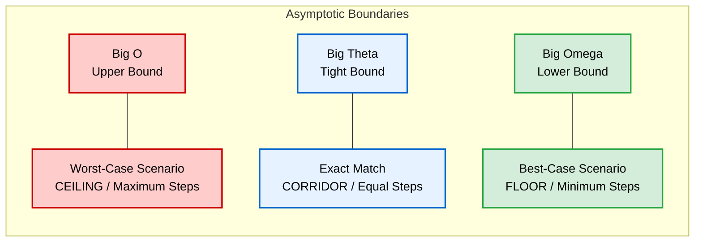

# Week 3: Algorithms

## Counting Methods & Visualizing Algorithms

When we need to solve a problem, like counting the total number of people in a room, the efficiency of our program depends entirely on the algorithm we choose.

### 1. Linear Counting (The Naive Approach)
This is the most basic method, equivalent to the "verbalized algorithm" used in Week 0 to count pages one by one.
* **How it works:** One counter walks through the room, pointing at each person and incrementing the total by 1 ($1, 2, 3, 4...$).
* **Characteristics:** It is slow but simple. If there are $n$ people, it takes exactly $n$ steps.

### 2. Recursive Counting (The CS50 Audience Experiment)
Instead of using a single counter, this approach divides the problem into identical sub-problems.
* **How it works:** 
  1. Every person stands up and holds the value `1`.
  2. People pair up. One person adds both values together, while the partner sits down.
  3. The remaining people repeat the process with their new, larger values.
* **Characteristics:** The problem size splits in half during each cycle. Eventually, only one person remains standing, holding the total sum.

### 3. Key Distinction: Iteration vs. Recursion
* **Iteration:** Solving a problem by repeating a process using loops (like `for` or `while` statements) over a dataset.
* **Recursion:** A technical concept where a function solves a problem by calling a smaller version of itself. 
  * *Note: We will implement the code for this later in the lecture.*

---

## Understanding Big O Notation

In computer science, we don't measure the speed of an algorithm in seconds, because a faster computer will always execute code quicker than an older one. Instead, we measure **Time Complexity**: *how the number of steps increases as the size of the input grows.*

**Big O notation** is the mathematical language we use to describe the **worst-case scenario** of an algorithm (the absolute maximum number of steps required to finish the job).

Think of the capital **O** as standing for *"On the order of"*.

### Common Big O Running Times (From Slowest to Fastest Growth)

#### 1. $O(n)$ Linear Time
* **Meaning:** The number of steps grows proportionally to the size of the input ($n$).
* **Example:** The basic, page-by-page or person-by-person counting method. If you have 100 people, it takes 100 steps. If you have 1,000 people, it takes 1,000 steps.

#### 2. $O(\log n)$ Logarithmic Time
* **Meaning:** The problem space is divided in half at every single step. As the input grows huge, the number of steps increases very slowly.
* **Example:** **Binary Search** (the phone book experiment where you flip to the middle and tear pages in half) or the **Recursive Counting** experiment with the audience. Even if you double the number of people in the theater, it only adds *one extra step* to the whole process.

#### 3. $O(1)$ Constant Time
* **Meaning:** The algorithm always takes the exact same number of steps, regardless of how big the input is.
* **Example:** Checking if a single number is even or odd, or looking at the value held by the very last person standing in the theater. It takes 1 step whether there are 10 people or 10,000.

## Running Time and Time Complexity

**Running Time** (or **Time Complexity**) refers to the efficiency of an algorithm. It does not measure time in seconds, but rather the number of mathematical or computational steps required to solve a problem as the size of the input ($n$) grows.

In computer science, we use **Big O Notation** to categorize an algorithm's running time based on its **worst-case scenario** (the absolute maximum number of steps it could take).

### Terminology & Descriptions

When describing how fast or efficient an algorithm is, we can say:
* *"This algorithm has a **linear running time**."* or *"This algorithm is **linear**."*
* In Italian, we refer to this concept as **Complessità Temporale** (e.g., *"Questo algoritmo ha una complessità logaritmica"*).

### Summary of Running Times (From Worst to Best)

| Big O Notation | Pronunciation (EN / IT) | Technical Name | Algorithm Example |
| :--- | :--- | :--- | :--- |
| **$O(n)$** | *"Big O of n"*<br>• *"O di enne"* | **Linear Time**<br>• *Tempo Lineare* | **Linear Search** (checking every element one by one) |
| **$O(\log n)$** | *"Big O of log n"*<br>• *"O di log enne"* | **Logarithmic Time**<br>• *Tempo Logaritmico* | **Binary Search** (dividing the dataset in half each step) |
| **$O(1)$** | *"Big O of 1"*<br>• *"O di uno"* | **Constant Time**<br>• *Tempo Costante* | **Direct Lookup** (instantly checking a single known index) |

### Advanced Big O Running Times (From Fastest to Slowest Growth)

#### 4. $O(n \log n)$ Linearithmic Time (Tempo Linearitmico)
* **Meaning:** This is a combination of linear time ($n$) and logarithmic time ($\log n$). It represents algorithms that divide a problem in half (logarithmic) but must repeat that division process for every single element in the dataset (linear).
* **Example:** Efficient sorting algorithms, like **Merge Sort**. It is the standard benchmark for sorting large datasets efficiently.

#### 5. $O(n^2)$ Quadratic Time (Tempo Quadratico)
* **Meaning:** The number of steps grows exponentially relative to the square of the input size. If you double the dataset size ($2n$), the execution steps quadruple ($4n^2$). This happens when an algorithm uses nested loops (a loop inside another loop) to compare every element with every other element.
* **Example:** Slow, brute-force sorting algorithms like **Bubble Sort** or **Selection Sort**. If you have 1,000 players to sort by score using Bubble Sort, it could take up to 1,000,000 steps.

#### 6. $O(2^n)$ Exponential Time (Tempo Esponenziale)
* **Meaning:** The number of steps doubles with every single additional element added to the dataset. This is extremely inefficient and represents algorithms that try every possible combination or solution to a problem.
* **Example:** Solving complex puzzles like the Traveling Salesperson Problem by brute force, or calculating Fibonacci numbers using a naive recursive approach. Even with a small input (like $n = 50$), an $O(2^n)$ algorithm can take years to finish executing on a supercomputer.

## Asymptotic Notation (Notazione Asintotica)

### What does "Asymptotic" mean?
The word **Asymptotic** (from the mathematical term *asymptote*) refers to looking at the behavior of a function as it approaches infinity. 

In computer science, **Asymptotic Notation** means evaluating how an algorithm performs as the input size ($n$) becomes **extremely large (approaching infinity)**. 
* It ignores hardware speed, system background tasks, and minor constants (like whether a loop takes $n+2$ or $n+5$ steps).
* It focuses strictly on the "shape" of the growth curve of the algorithm's running time.
  
## In short

Asymptotic notation describes how the workload grows for the **CPU**, indicating the algorithm's complexity. Mathematical expressions are used instead of **execution time** because the complexity of an algorithm does not depend on the hardware. This is  called **asymptotic running time**.

---

## The Three Types of Asymptotic Boundaries

To fully describe an algorithm's efficiency, we use three different mathematical symbols, each representing a different scenario: **Worst-Case**, **Best-Case**, and **Tight-Bound**.



---

 **Mermaid Quick Reference (Extra)**

> **What is Mermaid?** A JavaScript-based tool that renders text syntax into visual diagrams directly within Markdown. It uses a logic similar to programming languages combined with CSS-like styling properties.

#### 1. Graph Direction
* `graph TD`: Top-Down (Dall'alto verso il basso)
* `graph LR`: Left-to-Right (Da sinistra a destra)

#### 2. Node Shapes (Forme dei blocchi)
* `ID[Text]`: Rectangle (Rettangolo classico)
* `ID(Text)`: Rounded Rectangle (Rettangolo smussato)
* `ID{Text}`: Diamond (Rombo per condizioni/decisioni `if`)

#### 3. Connections (Collegamenti)
* `A --> B`: Arrow connection (Linea con freccia)
* `A --- B`: Simple line connection (Linea semplice senza freccia)
* `A -->|Label| B`: Arrow with text (Freccia con testo descrittivo)

#### 4. Comments & Styling
* `%%`: Used to write comments within the Mermaid block (Ignored by the compiler).
* `classDef`: Defines custom CSS styles (e.g., `fill` for background, `stroke` for borders, `color` for text).
* `class`: Applies a defined style to specific nodes.

*Test and build diagrams in real-time using the official [Mermaid Live Editor](https://mermaid.live/).*

---

### 1. Big O ($O$) — The Upper Bound (Worst-Case)
* **Definition:** The mathematical representation of the **maximum** number of steps an algorithm will ever take. It guarantees that the algorithm will never perform worse than this curve.
* **Analogy:** A ceiling. The running time cannot go above it.
* **Example:** For **Linear Search**, the worst-case is that the item is at the very end of the list or not there at all: **$O(n)$**.

### 2. Big Omega ($\Omega$) — The Lower Bound (Best-Case)
* **Definition:** The mathematical representation of the **minimum** number of steps an algorithm can take. It describes the absolute best-case scenario.
* **Pronunciation:** *"Big Omega"* / *"Omega"*
* **Analogy:** A floor. The running time cannot drop below it because the computer must perform at least this many steps.
* **Example:** For **Linear Search**, the best-case is finding the item on the very first try: **$\Omega(1)$**.

### 3. Big Theta ($\Theta$) — The Tight Bound (The Exact Match)
* **Definition:** This symbol is used **only** when the worst-case scenario ($O$) and the best-case scenario ($\Omega$) are exactly identical. It represents a tight bound, meaning the algorithm always behaves exactly the same way regardless of the data structure.
* **Pronunciation:** *"Big Theta"* / *"Theta"* (In Italian: *"Capital Theta"*)
* **Analogy:** A narrow corridor where the ceiling and floor meet.
* **Example:** An algorithm that counts elements by walking through a room one by one. Even if the room is full of your friends or total strangers, the algorithm *must* check every single person. Its best-case is $n$ steps ($\Omega(n)$) and its worst-case is $n$ steps ($O(n)$). Therefore, its tight bound is **$\Theta(n)$**.

---

### Quick Comparison Table for Reference

| Notation | Symbol | Scenario | What it represents | Example (Linear Search) |
| :--- | :---: | :--- | :--- | :--- |
| **Big O** | $O$ | **Worst-Case** | Maximum ceiling | $O(n)$ — Item is last |
| **Big Omega** | $\Omega$ | **Best-Case** | Minimum floor | $\Omega(1)$ — Item is first |
| **Big Theta** | $\Theta$ | **Tight Bound** | Floor and Ceiling are equal | *Not applicable to Linear Search* |

---
### What is a `struct`?

In C, standard data types (`int`, `char`, `float`) only hold one single value. A `struct` (structure) allows you to **create your own custom data type**. It acts like a container that groups different variables together under one single name.

### Why use `typedef`?

By adding `typedef` before `struct`, you give your new data type a clean, permanent shortcut name (like `item` or `player`). This means you do not have to type the word `struct` every time you want to create a new variable.

### Accessing Data with the Dot Operator (`.`)

To put data into a struct or read data from it, you use the **dot operator**.

- Syntax: `variable_name.member_name` (for example: `custom_sword.count = 1;`).

### Creating Arrays of Structs

Instead of managing multiple independent arrays for names, counts, and statuses, you can group everything into one clean array of your custom type:

`item inventory[36]; // An entire inventory managed in one single line of code`

### Practice

```
#include <cs50.h>
#include <stdio.h>

// 1. Define the custom data type named "item"

typedef struct
{
    char *name;
    int count;
    bool is_stackable;
}
item;

int main(void)
{
    // 2. Create a variable using our new "item" type
    item custom_sword;

    // 3. Assign values to the characteristics using the dot (.) operator
    custom_sword.name = "Netherite Sword";
    custom_sword.count = 1;
    custom_sword.is_stackable = false;

    // 4. Read and print the data inside the struct
    printf("Item: %s\n", custom_sword.name);
    printf("Amount: %i\n", custom_sword.count);
    
    if (custom_sword.is_stackable)
    {
        printf("This item can be stacked.\n");
    }
    else
    {
        printf("This item cannot be stacked.\n");
    }
}
```

# Quadratic vs. Exponential Growth

Both terms describe how a program slows down as data ($n$) increases, but they grow at vastly different speeds.

### 1. Quadratic Growth: $O(n^2)$
- **How it works:** The data size ($n$) is the *base*, raised to a constant power (2).
- **Formula pattern:** $n \times n$
- **Example:** If $n = 10$, operations = $10^2 = 100$. If $n$ doubles to $20$, operations = $20^2 = 400$ (4 times more).
- **Context:** Slow for huge datasets, but very common in basic sorting algorithms.

### 2. Exponential Growth: $O(2^n)$
- **How it works:** The data size ($n$) is the *exponent*. Every time you add just **one** single item to your data, the total work **doubles**.
- **Formula pattern:** $2 \times 2 \times 2...$ ($n$ times)
- **Example:** If $n = 10$, operations = $2^{10} = 1,024$. If $n$ doubles to $20$, operations = $2^{20} = 1,048,576$.
- **Context:** Extremely dangerous. Programs with exponential growth quickly become impossible to run, even for supercomputers.

---

# The Two Sorting Algorithms

Malan uses these two classic algorithms to show **Quadratic $O(n^2)$** efficiency in action:
### 1. Selection Sort
- **How it works:** It scans the entire array to find the smallest element, swaps it into the first position, then moves to the next position and repeats.
- **Analogy:** Looking through a messy pile of cards from left to right, finding the lowest card, putting it at the start, and repeating.
### 2. Bubble Sort
- **How it works:** It compares adjacent pairs of numbers next to each other and swaps them if they are in the wrong order. It loops through the array repeatedly until the highest numbers "bubble up" to the end.
- **Analogy:** Comparing card 1 and card 2, swapping them if needed, then comparing card 2 and card 3, moving down the line until the deck is sorted.

---
# LaTeX Formatting with `$` (extra)

In Markdown (and Obsidian), the dollar sign `$` is used to render clean, professional math symbols and equations.

- **Inline Math (`$...$`):** Keeps variables or formulas inside the text line.
  - *Example:* `$n$` becomes $n$.
- **Display Math (`$$...$$`):** Centers the formula and makes it larger on its own line.
  - *Example:* `$$\frac{n(n-1)}{2}$$` creates a formatted fraction.
$$\frac{n(n-1)}{2}$$
---
